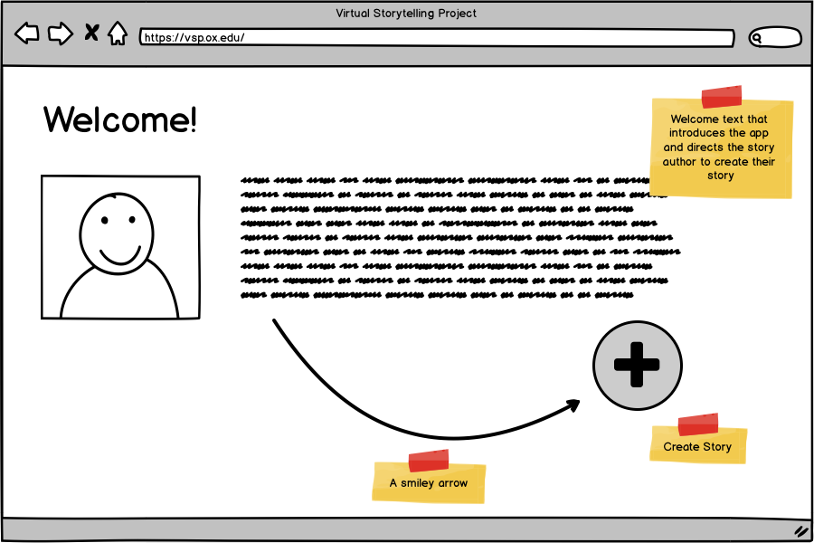

# Wireframes

Wireframes used to guide the implementation of the
Virtual Storytelling Project (VSP).

## Welcome

This is the page that the story author (hereafter author)
sees when they visit the VSP homepage.

## First Scene

This is the page that the author sees when clicking
_New Story_.

## First Scene :: Components

Here's a _rough_ breakdown of possible components
for the _First Scene_ page.

## Completed First Scene

The author has created their first scene:

* they've uploaded a 360° panoramic image
* they've written their interactive fiction (IF)

Their next step might be to _Play_ their story or
to add another scene.
